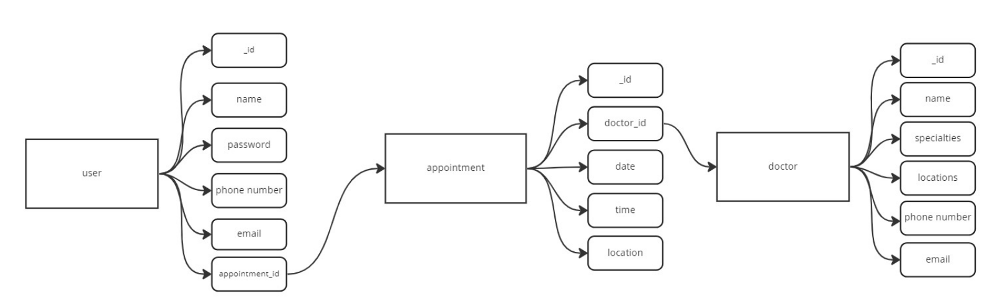
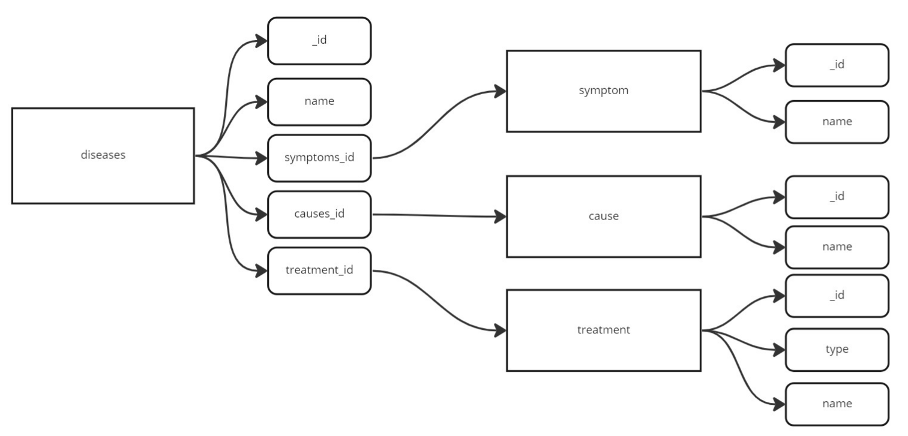

# Healthy-HearTechs

Welcome to our health website, where you can find information and solutions for common health problems.

<hr>

## Features

- Enter your health problem and get a list of possible cures, both ayurvedic and allopathic.
- Find detailed information about the doses and side effects of different medicines.
- Use our Google Maps API to locate and connect with the nearest doctor who can help with your problem.
- Book an appointment with a doctor of your choice.
<hr>

## How to use

- Visit our website and enter your health problem in the search bar.
- Browse through the list of suggested cures and select the one that you think might be most suitable for your condition.
- Click on a cure to view more detailed information about the medicine, including its doses and potential side effects.
- If you would like to consult a doctor, click on the "Find a Doctor" button.
- Enter your location and search for doctors in your area.
- Select a doctor from the list and book an appointment.
<hr>
<i>We hope that our health website helps you find the information and solutions you need to improve your health and well-being.</i>

<hr>

## Tech Stack

- Frontend: HTML, CSS, JavaScript
- Backend: Node.js
- Database: MongoDB
- APIs: Google Maps API
<hr>

## Architecture





<hr>
## Installation and Setup

Clone the repository:

```
https://github.com/AnmolVerma404/Healthy-HearTechs.git
```

Navigate to the project directory:

```
cd Healthy-HearTechs
```

Install the dependencies in client and server side

```
npm install
```

## Contributing

To contribute to the project, please follow the below guidelines:

- Fork the repository.
- Create a new branch for your changes.
- Commit your changes and push to your branch.
- Create a pull request to the upstream repository.
- Wait for your pull request to be reviewed and merged.

## License

This project is licensed under the MIT License - see the [LICENSE](./LICENSE) file for details.
